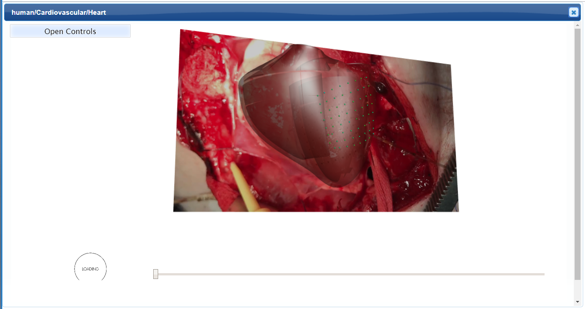
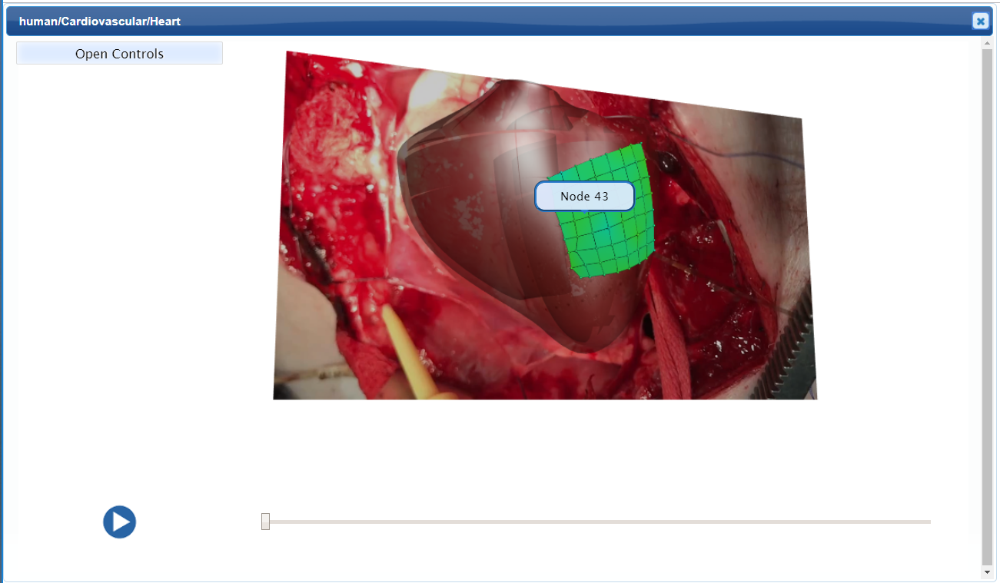
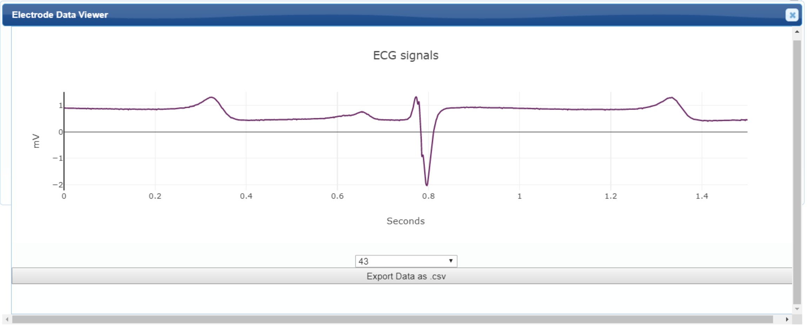
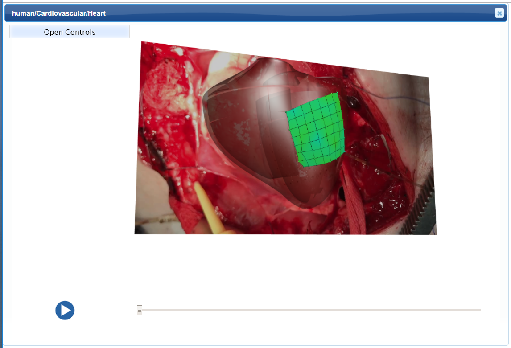
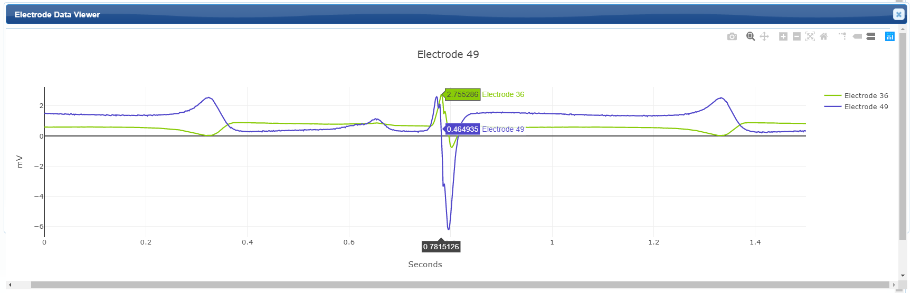
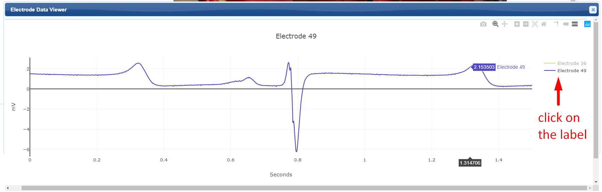

Pig Heart
=========

.. |zoom-in| image::  /_images/flatmap_zoomIN.png
               :width: 2 em

.. |zoom-out| image:: /_images/flatmap_zoomOUT.png
               :width: 2 em
			   
.. |resize| image:: /_images/flatmap_resize.png
               :width: 2 em
			   
.. |organs| image:: /_images/flatmap_organs.png
               :width: 2 em
			   
.. contents:: Contents: 
   :local:
   :depth: 2
   :backlinks: top
   
Overview
********

This document describes how to view and interact with fitted heart models of the neurocardiology experiments from the University of California, Los Angeles (UCLA).

The demonstration for this module is available at https://mapcore-demo.org/2018-datathon/ecg_data/.

Step-by-step instructions 
*************************

Follow these step-by-step instructions to familiarise yourself with the flow of the web interface.

**Step 1:** Allow a few seconds of time for models to load.

   
**Step 2:** Select a *node* to open it's ECG data in a seperate viewer i.e. the Electrode Data Viewer.

   
**Step 3:** Navigate through the video with the play button and slider.

Working with the interface
**************************

This section explains how to use more specific features of the interface.

Organs Viewer
^^^^^^^^^^^^^

The *Organs Viewer* interface is used to view the anatomical organs in 3D model.

.. note::

   The organ scaffold visualisation can be manipulated by the following interactive graphics controls. 

    ======================= ==============
    Mouse Button            Transformation
    ======================= ==============
    Left                    Rotate
    ----------------------- --------------
    Middle 				          Zoom
    ----------------------- --------------
    Right 					        Pan
    ======================= ==============

Model Controls
~~~~~~~~~~~~~~

* The :guilabel:`Open Controls` button at the top-left corner of this demonstration opens extended controls which help to edit the visualisation and configuration of the model.

	* :guilabel:`Background` control - provides an option to change the background color. 

	* :guilabel:`Reset View` control - restore the organ scaffold to the default state.

	* :guilabel:`View All` control - reinstate the organ scaffold to the current working state.

	* :guilabel:`Speed` control - adjusts the video's playback speed.		

	* :guilabel:`Visibilty Control` displays various checkboxes that toggle visibility of the meshes.

		* :guilabel:`Video plane` is a flat surface showcasing the video data.
		* :guilabel:`ECG Nodes` are the electrodes projected on the epicardial surface.
		* :guilabel:`Fitted Heart` registers the heart scaffold to the video data.
		* :guilabel:`ECG projection` interpolates electrical activity over the surface of the heart. 
		

* The :guilabel:`Close Controls` button closes the expanded controls panel.
	
Electrode Data Viewer
^^^^^^^^^^^^^^^^^^^^^

This viewer is used to view the *Electrocardiograph* data recorded with the experiment video.

* Refine the view by draging over a region of interest.

* Add or remove data by clicking on it's label

   