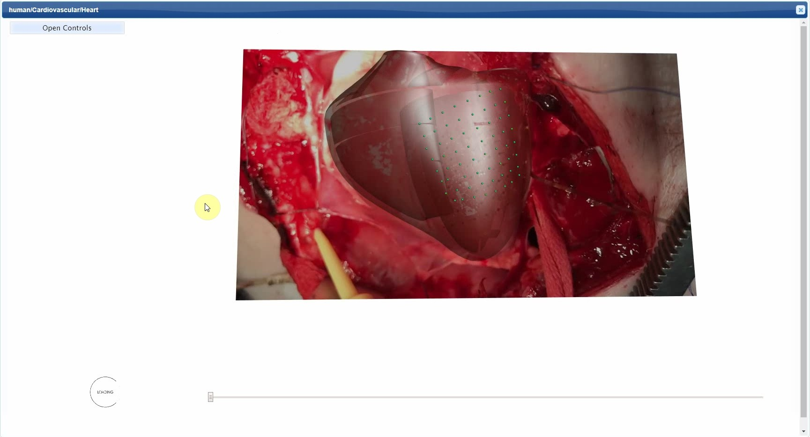
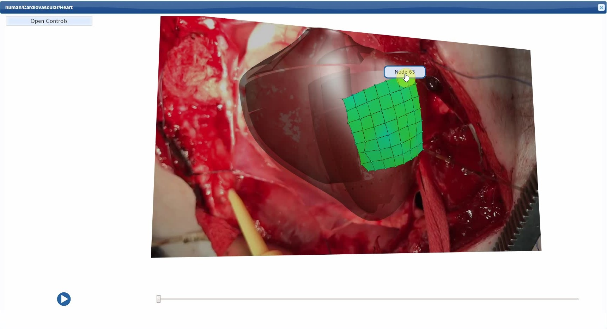
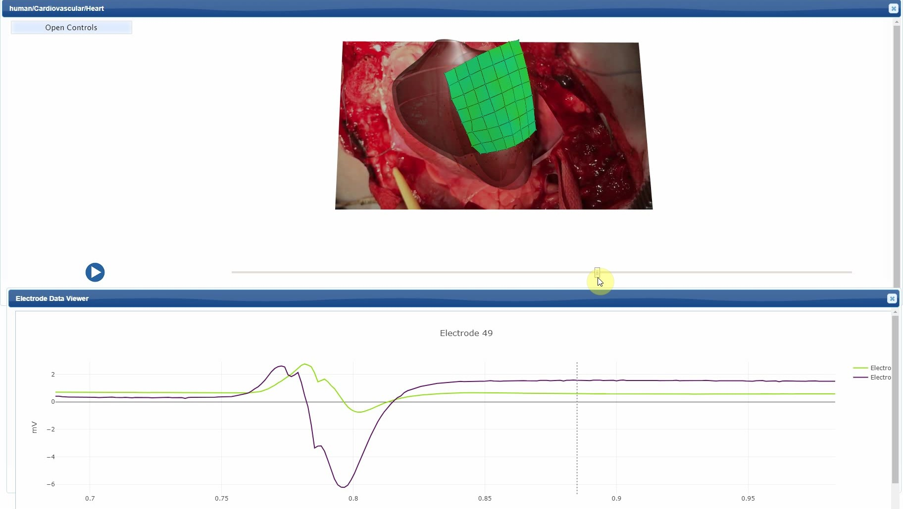
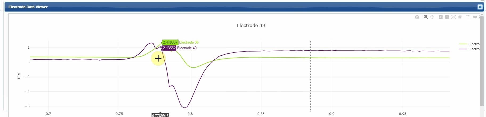
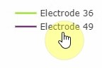

Pig Heart
=========

.. |zoom-in| image::  /_images/flatmap_zoomIN.png
               :width: 2 em

.. |zoom-out| image:: /_images/flatmap_zoomOUT.png
               :width: 2 em
			   
.. |resize| image:: /_images/flatmap_resize.png
               :width: 2 em
			   
.. |organs| image:: /_images/flatmap_organs.png
               :width: 2 em
			   
.. contents:: Contents: 
   :local:
   :depth: 2
   :backlinks: top
   
Overview
********

This document describes how to view and interact with fitted heart models from UCLA Neurocardiology expirements in browser.

.. add the demo url 
The demonstration for this module is available at https://mapcore-demo.org/2018-datathon/ecg_data/

Step-by-step instructions 
*************************

Follow these step-by-step instructions to familiarise yourself with the flow of the web interface.

**#. Step 1:** Allow time for models to load

This normally takes 5-10 seconds

   
**#. Step 2:** Select a node to open it's ECG data in a seperate viewer

**#. Step 3:** Navigate through the video with the play button and slider

How to work with this interface?
********************************

This section explains how to use more specific features of the app.

Organs Viewer Pane
^^^^^^^^^^^^^^^^^^

Organs Viewer is the window used to view the anotomical organs in 3D.

.. note::

   The organ scaffold visualisation can be manipulated by the following :doc:`InteractiveGraphicsControls`. 

    ======================= ==============
    Mouse Button            Transformation
    ======================= ==============
    Left                    Rotate
    ----------------------- --------------
    Middle 				          Zoom
    ----------------------- --------------
    Right 					        Pan
    ======================= ==============

Model Controls
~~~~~~~~~~~~~~

* The :guilabel:`Open Controls` button at the top-left corner of this demonstration opens extended controls over the models.

* :guilabel:`Background` control provides an option to change the background color. 

* :guilabel:`Reset View` control restore the organ scaffold to the default state.

* :guilabel:`View All` control ensures the entire organ scaffold is visible.

* :guilabel:`Speed` control adjusts the videos playback speed.

* Checkboxes toggle visibility of the meshes.

* The :guilabel:`Close Controls` button closes the expanded controls panel.
	
Chart Pane
^^^^^^^^^^

This pane is used to view Electrocardiograph data recorded with the expirement video.

* Refine the view by draging over a region of interest

.. figure:: _images/plot_refine.jpg
   :figwidth: 95%
   :width: 70%
   :align: left

.. ..

* Add or remove data by clicking on it's label

   