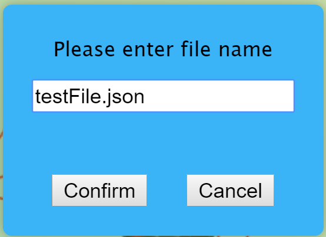
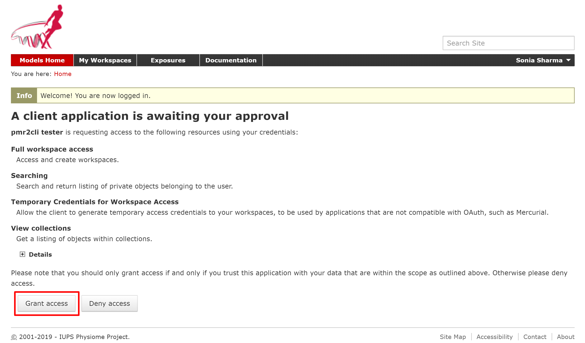
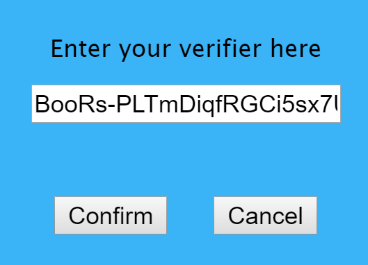
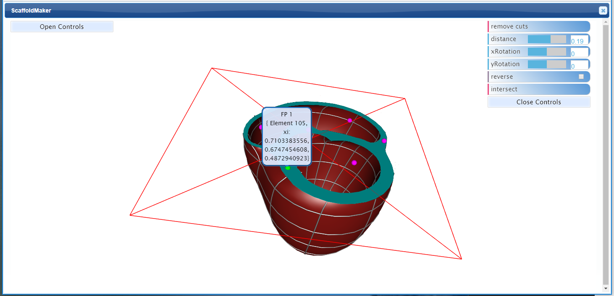

Scaffold and Fiducial Marker
============================

.. contents:: Contents: 
   :local:
   :depth: 2
   :backlinks: top
   
Overview
********
   
This document describes how to use the 'Scaffold and Fiducial Marker' module of the MAPcore Datathon portal. The demonstration for this module is available at https://mapcore-demo.org/2018-datathon/portal/scaffold/. 

Controls
********

This section explains the *Left*, *right* and the *interactive graphics* controls. 

Left Controls
^^^^^^^^^^^^^

The :guilabel:`Open Controls` button at the top-left corner of the MAPcore Datathon portal elaborates different controls which helps to pinpoint any modifications made in the organ.

Functionality of different *controls*:

* **View All** - this control helps the organ to return to the original state from the enlarged position.

* **Read** - provides an option to use the existing Physiome Model Repository(PMR) workspace.

* **Commit** - helps to save the changes locally.

* **Push** - helps to save the changes on the Physiome Model Repository(PMR).

* **Mesh Types** - displays various kinds of organs/shapes but presently only heart related options are functional. The default organ which is showcased is "3d_heart1".

* **Parameters** - these are the numerical values which defines the various attributes of the organs/shapes. The values has been preset to provide a basic configuration of the organ.

* **Regions** - helps viewing the varied parts of the organ/shape. Currently, this functionality works only for the heart. Hovering over the different regions highlights the particular selected area of the organ. 

The :guilabel:`Close Controls` button closes the expanded controls panel.
 

Interactive Graphics Controls
^^^^^^^^^^^^^^^^^^^^^^^^^^^^^

The table below describes the effect of different mouse buttons in manipulating the view:

======================= ==============
Mouse Button            Transformation
======================= ==============
Left                    Rotate
----------------------- --------------
Middle 				    Zoom
----------------------- --------------
Right 					Pan
======================= ==============

Right Controls
^^^^^^^^^^^^^^
 
On the top-right corner of the MAPcore Datathon portal, you will find another set of controls that supports rotating the 'cutting plane' along x-axis or y-axis , intersecting it as well as setting the distance of the cutting plane and so on. Click on the :guilabel:`Open Controls` button to work with various controls. 

These *controls* are explained below:

#. **Remove cuts** - is used to delete the intersected surface created by the *intersect* control.
#. **Distance** - determines the distance of the cutting plane from the center of the organ/shape.
#. **xRotation** - supports the rotation of the cutting plane along the x-axis.
#. **yRotation** - supports the rotation of the cutting plane along the y-axis.
#. **Reverse** - is the control which provides the ability to view the opposite side of the organ from the cutting plane.
#. **Intersect**- as the name suggest, creates an intersect surface between the organ and the cutting plane.

The :guilabel:`Close Controls` button closes the expanded controls panel.

Working with the Physiome Model Repository
******************************************

The 'Scaffold and Fiducial Marker' module of the MAPcore Datathon portal supports using the existing Physiome Model Repository(PMR) workspace as well as saving the changes on the PMR. This can be achieved through the three controls (Read,Commit and Push) explained in the `Left Controls`_ section.

Read Control
^^^^^^^^^^^^
This control provides an option to use the existing Physiome Model Repository(PMR) workspace.

Steps:

1. Click on *Open Controls* button present on the top left corner of the datathon portal.
2. Click on the **Read** control.
3. A new window will pop-up, enter the PMR workspace URL (e.g. https://models.physiomeproject.org/workspace/xx where 'x' is your workspace id) and click on 'Confirm'.

.. figure:: _images/read_window1.png
   :figwidth: 61%
   :width: 51%
   :align: center
   
4. Enter the file name from your PMR workspace and click on Confirm. For example:

5. A new message is prompted 'Workspace may be private, please press confirm to identify yourself.' , click on Confirm.

.. figure:: _images/read_window3.png
   :figwidth: 71%
   :width: 71%
   :align: center

6. Login to the PMR and click on *Grant Access* to establish the connection between the datathon portal and the PMR.

7. Copy the verification code from the PMR and enter this code on the datathon portal. Click on Confirm. As an example:

.. figure:: _images/read_window5.png
   :figwidth: 91%
   :width: 81%
   :align: center
   
   **PMR portal**
  
  

   **Datathon portal**

   
Commit Control
^^^^^^^^^^^^^^
The *Commit* control helps to save the changes locally.

Steps:

#. Click on *Open Controls* button present on the top left corner of the datathon portal.
#. Click on the **Commit** control.
#. A window will pop-up, enter the message mentioning the information about the changes made and click on Confirm.
#. This new window displays the success message about the committed changes. Click on Confirm.

Push Control
^^^^^^^^^^^^
The *Push* control helps to save the changes on the Physiome Model Repository(PMR).

Steps:

#. Click on *Open Controls* button present on the top left corner of the datathon portal.
#. Click on the **Push** control.
#. A new window appears with a message - "Are you sure you want to push the changes?" , click on Confirm.
#. Another message populates confirming the changes being saved on the PMR. Click on Confirm.

.. note::

   The **History** tab on the PMR shows the log of changes made.

Creating the Fiducial points
****************************

Follow the steps below:

#. Click on *Open Controls* button present on the top right corner of the datathon portal.
#. Go to the **distance** control and select the distance of the cutting plane from the center of the organ.
#. Click on the **intersect** option.
#. Click at the particular location on the intersected surface to create the fiducial point.
#. Enter the annotation and click on confirm.

   
   Created Fiducial Point: FP 1 

